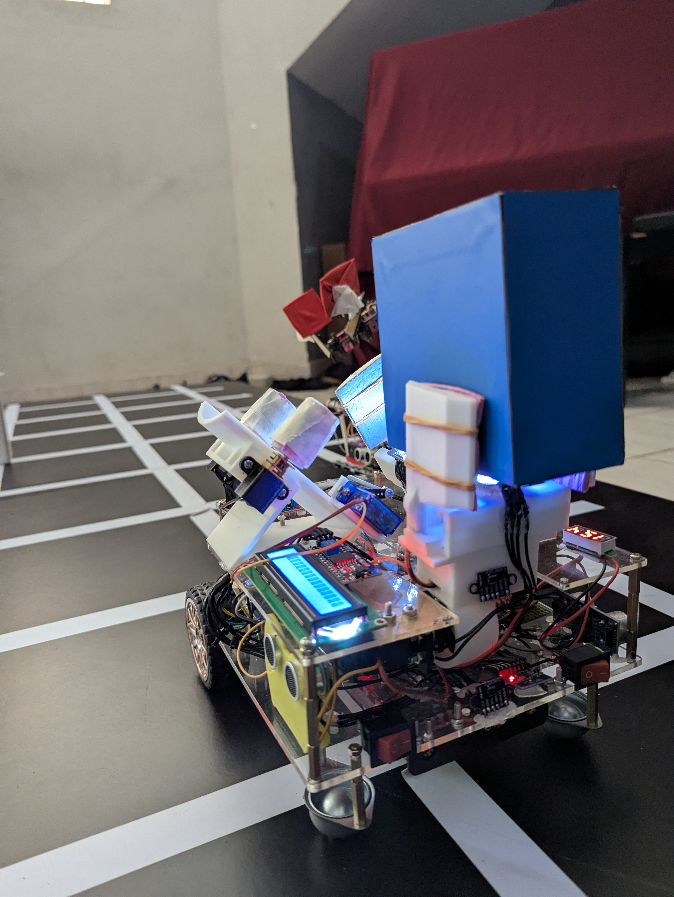
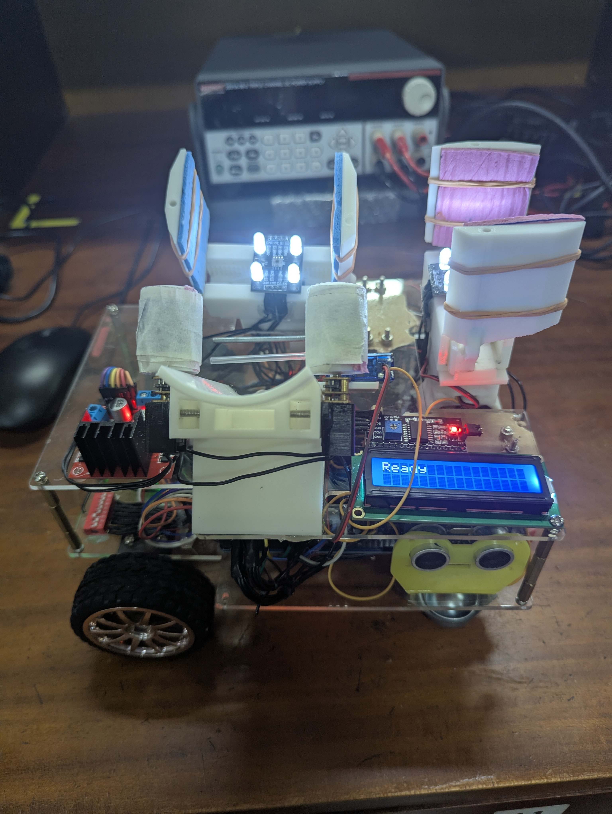
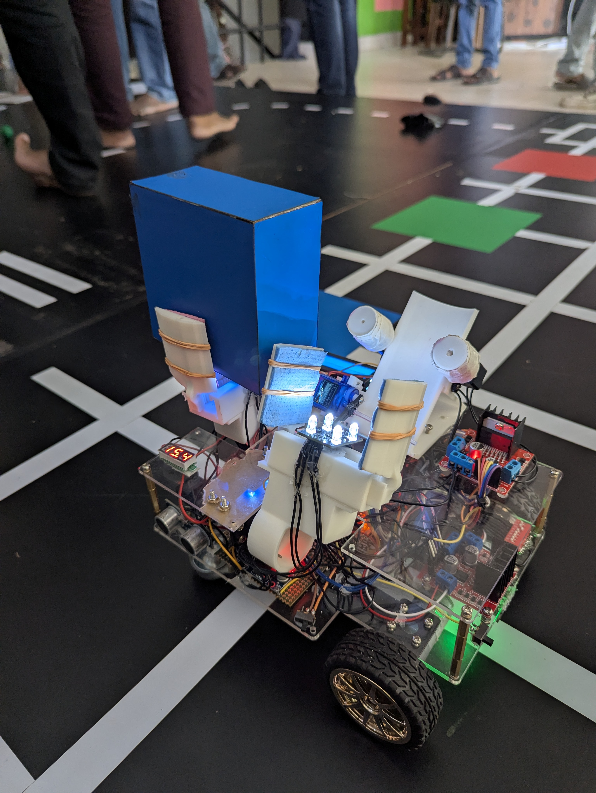

# Autonomous Arena Competition Robot

An autonomous mobile robot developed for the EN2533 Robot Design and Competition module at the University of Moratuwa.

## Overview

This project involved designing and building a fully autonomous robot capable of completing multiple tasks inside a competition arena. The robot was developed to operate without manual control by using sensor feedback, embedded programming, and real-time decision-making logic.

## Project Objective

The main objective was to design an autonomous robot that could navigate the arena, detect required targets or conditions, and complete competition tasks accurately and reliably within the given rules.

## Key Features

- Fully autonomous operation
- Arena-based navigation
- Sensor-based decision-making
- Motor control and movement logic
- Task-specific robot behavior
- Real-time embedded control
- Competition-oriented robot design

## Hardware Used

- Microcontroller: Arduino Mega
- Motor driver: L298N
- DC geared motors
- Wheels / chassis
- Sensors: ToF/ TCS34725/ Raykha 8 bit IR Array
- Power supply: 4 x 3.7v Li-ion 1800mAh battery pack
- Other mechanical components

## Software and Tools

- Arduino C++ / PlatformIO
- Embedded motor control
- Sensor calibration
- Autonomous task logic
- SolidWorks / mechanical design tools, if used

## My Contribution

My main contributions included:

- Robot programming
- Sensor integration
- Autonomous logic development
- Motor control tuning
- Testing and debugging
- Mechanical/electrical assembly support

## Robot Design

The robot was designed to complete arena tasks autonomously by processing sensor inputs and controlling its motors according to task-specific logic.

## Project Images

### Final Robot

### Top View

### Side View

## Code

The source code used for the robot is available in the `code` folder.

## Future Improvements

- Improve navigation accuracy
- Add better sensor fusion
- Optimize motor control response
- Improve mechanical stability
- Add modular task-based software architecture
- Implement advanced path-planning algorithms
